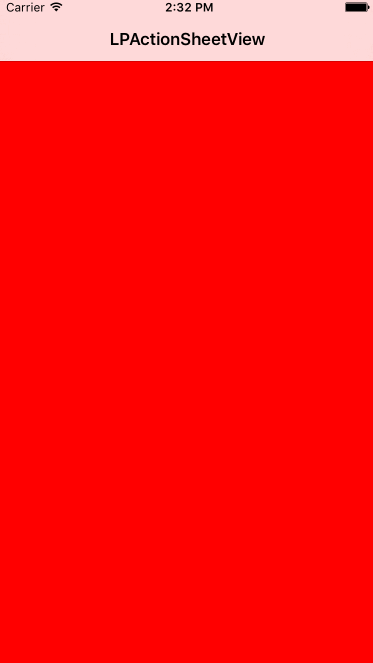

# LPActionSheetView

fully custom action sheet view

# Install

`pod 'LPActionSheetView', '~> 0.0.3'`

# Usage

`LPActionSheetView is like a structure or container for actionSheet `

- header & footer

```swift
// conform dataSource protocol and implement with your custom header anything you want to set them in free totally!
```

- sheet cells
```swift
// conform dataSource protocol as header & footer, do your any customization
```

- properties
```swift
//background mask view height type
typedef NS_ENUM(NSInteger, LPMaskViewExtend)
{
    LPMaskViewExtendUnderStatusBar,
    LPMaskViewExtendUnderNavigationBar,
    LPMaskViewExtendFullScreen
};
```

# Screenshot



# Release Notes

- 0.0.3

add deSelected delegate method & allSheetCells property

- 0.0.2

header & footer optimization & add selected sheet cell

- 0.0.1

first version
